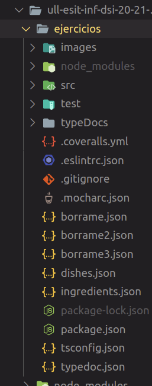

# Práctica 7: Modelo de datos de un sistema que permite el diseño de menúsTarea

## 1. Introducción

A modo de introducción, se detallará un informe de la séptima práctica de la asignatura Desarrollo de Sistemas Informáticos del grado de Ingeniería Informática sobre un diseño orientado a objetos del modelo de datos de un sistema de información que permite el diseño de menús. 

Esta práctica es la primera que se desarrolla en grupo y su estructura es similar a la de las prácticas individuales realizadas durante el cuatrimestre. Partimos de un directorio raíz el cual contiene los ficheros de configuración, el código fuente y las pruebas unitarias del proyecto. 

Se espera que se aprenda el manejo de los módulos inquirer.js y Lowdb para la interacción con los usuarios. 

### 1.1 Configuración del entorno de trabajo

Para configurar la estructura de ficheros, las dependencias y otras herramientas de desarrollo (_TypeDoc, Coveralls_.. etc), hemos creado un subdirectorio `ejercicios` donde se alamcena toda la información relacionada con el desarrollo:

```bash
$ mkdir ejercicios
```

Ayudándonos de los repositorios facilitados por el profesorado y la experiencia en prácticas anteriores, hemos instalado las dependencias y creado los ficheros de configuración para mostrar errores de código para facilitar el desarrollo, para realizar pruebas, generar documentación y Coveralls para asegurarnos de que el código está _"cubierto"_. Como resultado, la estructura final se ve de la siguiente manera:




## 2. Descripción de los requisitos del sistema de diseño de menús

Se pide la creación de un programa que permita interactuar con usuarios, por un lado, para poder modificar el inventario de ingredientes y menús y cartas, y por otro para que el cliente pueda ver la carta y hacer su pedido. 

### 2.1 Alimentos y/o ingredientes

La base de los menús y cada alimento debe constar de los siguientes elementos:

- Nombre.

- Lugar de origen.

- Grupo de alimentos:
    1. Carnes, pescados, huevos, tofu, frutos secos, semillas y legumbres.
    2. Verduras y hortalizas.
    3. Leche y derivados.
    4. Cereales.
    5. Frutas.

- Composición nutricional del alimento que se indica para cada 100 gr de alimento (Hidratos de carbono, proteínas y lípidos).

- Precio del alimento por kg en euros.

### 2.2 Platos

Será un conjunto de ingredientes y será del tipo entrante, primer plato, segundo plato o postre. La clase debe poder mostrar:

- Su lista de alimentos y/o ingredientes.

- Composición nutricional del plato. 

- Grupo de alimento predominante. 

- Precio del plato.

### 2.3 Menús

Es un conjunto de platos, uno de cada categoría o de tres. La clase debe poder mostrar lo siguiente:

- Precio del menú.

- Platos que lo componen con sus correspodientes alimentos y/o ingredientes.

- Composición nutricional.

- Listado de grupos de alimentos por orden de aparición.

### 2.4 Carta

Se debe poder crear una carta que contenga tanto menús como platos individuales de los que los clientes escojan todos los que quieran.

## 3. Funcionamiento

Para la interacción con los usuarios se debe crear una funcionalidad que permita la creación, modificación y borrado de ingredientes, platos o menús. 

Y una base de datos que disponga de 50 ingredientes, 5 platos de cada tipo, 5 menús y una carta.

### 3.1 Clase Comanda

Esta clase guardará el pedido de un cliente y se debe poder:

- Ver la carta (menús y platos con su información).

- Realizar una comanda donde el cliente pueda escoger un menú personalizar el suyo ya sea entero o variando alguno existente.


## 4. Desarrollo del proyecto

Para poder hacer la interacción con el usuario se usa Inquirer.js, esto es un módulo que permite coger lo que el usuario introduce en la linea de comandos en node.js haciendo una serie de preguntas y dando opciones de respuesta. 
Es necesario tener una base de datos con el stock de ingredientes y la carta disponible, y poder guardar la selección del cliente, para esto usamos el módulo Lowdb que permite la gestión de un base de datos.

Para realizar est proyecto hemos seguido la metodología TDD creando los test necesarios al inicio para las clases claseDish, classComanda, classMenu, classOrder y class Ingredient.

### 4.1 Clase ingredientes

En primer lugar, se ha creado una enumeración que permite definir un conjunto de constantes con nombre, en este caso, los diferentes grupos a los que pertecene un ingrediente. 

Acto seguido, se declara un alias de tipo para la tupla que contendrá la composición nutricional del alimento con respecto a los macronutrientes y kcal por 100 gr de dicho alimento.

Por último, la clase ingrediente se encarga de crear un objeto cuyas propiedades serán su nombre, localización, grupo al que pertenece como se detallaba anteriormente, los macronutrientes, el total de kcal y su precio. Destacar que todas estas propiedades son privadas, y se accederán a ellas desde otras clases importando a la misma con su ruta correspondiente y haciendo uso de los métodos get. 

Se puede observar el código a continuación:

```ts 
export enum ingredientGroups {group1, group2, group3, group4, group5};
export type NutritionalComposition = [string, number];
export class Ingredient {
    private nutritionalComposition: NutritionalComposition[];
  constructor(
        private name: string,
        private location: string,
        private group: ingredientGroups,
        private carbohydrates: number,
        private protein: number,
        private lipids: number,
        private kcal: number,
        private price: number,
    ) {
        this.nutritionalComposition = [["carbohydrates", carbohydrates], ["protein", protein], ["lipids", lipids]];
    }
    getName() {
        return this.name;
    }
    getLocation() {
        return this.location;
    }
    getGroup() {
        return this.group;
    } 
    getProteins() {
        return this.protein;
    }
    getCarbohydrates() {
        return this.carbohydrates;
    }
    getLipids() {
        return this.lipids;
    }
    getKcal() {
        return this.kcal;
    }
    getPrice() {
        return this.price;
    }
}
```
### 4.2 Clase plato

Para empezar, puesto que un plato puede ser de distintos tipos, estos se guardan en un enum para que pueda usarse para dar ese valor.

```ts
export const enum tipoPlato {ENTRANTE, PRIMER_PLATO, SEGUNDO_PLATO, POSTRE};              
```
Un plato es un conjunto de uno o más ingredientes, para guardar esos ingredietes se usa Map<> donde la clave será el ingrediente y el valor un number que representa la cantidad que lleva el plato de ese ingrediente. El usar Map evita repetir elementos.

```ts
export class Dish {
  public Ingredients: Map<Ingredient, number>;

  constructor(public dishName: string, ingredients: [Ingredient, number][],
      public plato: tipoPlato ) {
    this.Ingredients = new Map;

    ingredients.forEach((element) => this.Ingredients.set(element[0],
      element[1]));
  }
```

El resto de la clase consta de los métodos getters necesarios para devolver el nombre del plato, sus ingredientes, el tipo de plato y el número de ingredientes que lleva.

```ts 
getDishName(): string {
    return this.dishName;
  }
  getIngredients(): [Ingredient, number][] {
    let allIngredients: [Ingredient, number][] = [];
    const entries = [...this.Ingredients.entries()];
    for(let i = 0; i < entries.length; ++i) {
      allIngredients.push(entries[i]);
    }
    return allIngredients;
  }
  getDishType(): tipoPlato {
    return this.plato;
  }
  numberOfIngredients(): number {
    return this.Ingredients.size;
  }
```

Y los métodos para añadir un ingrediente, eliminar ingrediente, calcular el precio del plato y la composición nutricional, en base al precio de los ingredientes y encontrar el tipo de alimento predominante en el plato.

```ts 
addIngredient(ingredient: [Ingredient, number]): void {

    if(!this.Ingredients.get(ingredient[0])) {
      this.Ingredients.set(ingredient[0], ingredient[1]);
    }
  }
  predominantGroup(): ingredientGroups {
    let counters = [];
    let enumLength = (Object.entries(ingredientGroups)).length / 2;
    let result: number = 0;
    let maximum: number = -1;

    for(let i = 0; i < enumLength; ++i) {
      counters.push(0);
    }
    let iterator: IterableIterator<Ingredient> = this.Ingredients.keys();
    let actualElement: IteratorResult<Ingredient> = iterator.next();
 
    while(!actualElement.done) {
      const aux = actualElement.value.getGroup();
      ++counters[aux];
      actualElement = iterator.next();
    }
    for(let i = 0; i < counters.length; ++i) {
      if(counters[i]> maximum) {
        maximum = counters[i];
        result = i;
      }
    }
    function checkMaximumUnique(valuePosition: number) {
      return valuePosition == maximum;
    }
    if (counters.filter(checkMaximumUnique).length > 1) {
      return -1;
    }
    return result;
  }
  nutritionalComposition(): [number, number, number] {
    const entries = [...this.Ingredients.entries()];
    let totalCarbohydrates = 0; 
    let totalProteins = 0;
    let totalLipids = 0;

    entries.forEach((element) => {
      totalCarbohydrates += (element[0].getCarbohydrates() / 100) * element[1];
      totalProteins += (element[0].getProteins() / 100) * element[1];
      totalLipids += (element[0].getLipids() / 100) * element[1];
    });

    return [totalCarbohydrates, totalProteins, totalLipids];
  }
  totalPrice(): number {
    const entries = [...this.Ingredients.entries()];
    let total = 0;

    entries.forEach((element) => {
      total += (element[1] / 1000) * element[0].getPrice();
    });

    return total;
  }
  deleteIngredientByName(ingredientName: string): void {
    let ingredientsToRemove: Ingredient[] = [];
    const entries = [...this.Ingredients.entries()];
    // Get all the ingredients with the same name as the argument and store
    // them in an array.
    entries.forEach((element) => {
      if(element[0].getName() == ingredientName) {
        ingredientsToRemove.push(element[0]);
      }
    });
    for(let i = 0; i < ingredientsToRemove.length; ++i) {
      this.Ingredients.delete(ingredientsToRemove[i]);
    }
  }
  deleteIngredient(ingr: Ingredient): void {
    this.Ingredients.delete(ingr);
  }
}
```

### 4.3 Clase menú

Esta clase permite la creación de un menú, este menú esta compuesto por platos por lo que se crea un array de Dish.

```ts
export class Menu {
    private dishes: Array<Dish>;
    constructor(dishes:Array<Dish>) {
        this.dishes = dishes;
    }
```

La clase contiene métodos para devolver el precio total del menú, añadir platos, devolver la lista de platos, la composicion nutricional y la lista de grupos de alimentos.

```ts
 addDish(dish: Dish) {
        this.dishes.push(dish);
    }
    getDishes(): Array<Dish> {
        return this.dishes;
    }
    get price() {
        let sumPriceDishes = 0;
        this.dishes.forEach(element => {
            sumPriceDishes += element.totalPrice();
        });
        return sumPriceDishes.toFixed(2);
    }
    dishesList() {
        let list:Array<[string, Array<[Ingredient, Number]>]> = [];

        this.dishes.forEach(element => {
            list.push([element.getDishName(), element.getIngredients()]);
        });

        return list;
    }
    nutritionalComposition() :Array<number> {
        let composition : Array<number> = [0, 0, 0];
        this.dishes.forEach(element => {
            composition[0] += element.nutritionalComposition()[0];
            composition[1] += element.nutritionalComposition()[1];
            composition[2] += element.nutritionalComposition()[2];
        });
        return composition;
    }
    foodGroupList() : Array<ingredientGroups> {
        let list:Array<ingredientGroups> = [];
        this.dishes.forEach(element => {
            list.push(element.predominantGroup());
        });
        return list;
    }
```

### 4.4 Clase pedido

Recibe el pedido del cliente que puede ser un menu o platos y la cantidad de cada uno, para ellos se recibe en el constructor un Menu/Dish y un number. Como métodos de la clase están los getter para devolver la comanda realizada y la cantidad, y un set para modificar la cantidad elegida.

```ts
export class CustomerOrder {
  constructor(
    private order: Menu | Dish, 
    private cantidad: number) {}
 
  getComanda(): Menu | Dish {return this.order;}
  getCantidad(): number {return this.cantidad;}
  setCantidad(qt :number) {this.cantidad = qt;}
};

```

### 4.5 Clase comanda

Se encarga de guardar las comandas hechas. Tiene métodos para devolver las comandas, platos y menús y un método para añadir comandas.

```ts
export class Commanda {
  constructor(private orders: CustomerOrder[]) { }  

  getAllComandas(): CustomerOrder[] {
    return this.orders;
  }

  addComanda(newOrder: CustomerOrder) {
    this.orders = this.orders.concat(newOrder);
  }

  getDishes(): Dish[] {
    return this.orders.filter(
      (or) => or instanceof Dish)
      .map((or) => or.getComanda()) as Dish[];
  }
 
  getMenus(): Menu[] {
    return this.orders.filter(
      (or) => or instanceof Menu)
      .map((or) => or.getComanda()) as Menu[];
  }
};
```
### 4.6 Clase carta

Es un conjunto de menús y platos individuales. Al igual que en claseDish, se usa objetos Map<> para guardar los elemento de la carta.

```ts 
  public menus: Map<number, Menu>;
  public dishes: Map<string, Dish>;
  public ingredients: Map<string, Ingredient>;
  protected numberMenus: number = 0;

  constructor(menus: Array<Menu>, dishes: Array<Dish>, ingredients: Array<Ingredient>) {
    this.menus = new Map;

    menus.forEach((element) => this.menus.set(this.numberMenus + 1, element));
    
    this.numberMenus = this.numberMenus + 1;
    this.dishes = new Map;
    
    dishes.forEach((element) => this.dishes.set(element.getDishName(),
    element));

    this.ingredients = new Map;
  
    ingredients.forEach((element) => this.ingredients.set(element.getName(),
    element));
}

addMenu(menu: Menu) {
  this.menus.set(this.numberMenus + 1, menu);
  this.numberMenus = this.numberMenus + 1;
}
addDish(dish: Dish) {
  this.dishes.set(dish.getDishName(), dish);
}
addIngredient(ingredient: Ingredient) {
  this.ingredients.set(ingredient.getName(), ingredient);
}
getMenus(): [number, Menu][] {
  let allMenus: [number, Menu][] = [];
  const entries = [...this.menus.entries()];

  for(let i = 0; i < entries.length; ++i) {
    allMenus.push(entries[i]);
  }
  return allMenus;
}

getDishes(): [string, Dish][] {
  let allDishes: [string, Dish][] = [];
  const entries = [...this.dishes.entries()];

  for(let i = 0; i < entries.length; ++i) {
    allDishes.push(entries[i]);
  }
  return allDishes;
}
getIngredients(): [string, Ingredient][] {
  let allIngredients: [string, Ingredient][] = [];
  const entries = [...this.ingredients.entries()];

  for(let i = 0; i < entries.length; ++i) {
    allIngredients.push(entries[i]);
  }
  return allIngredients;
}
```
## 5. Conclusiones y dificultades

A modo de conclusión, nos ha resultado muy interesante la práctica para poner en práctica con mayor profundidad el uso de las clases y objetos en Typescript. Sin embargo, nos ha costado entender los módulos de Inquirer y del paquete Lowdb para la gestión de una línea de comandos interactiva. 

Hemos intentado establecer una base de datos en la que se parta de los diferentes menús, con sus respectivos platos y estos a su vez con sus correspondientes ingredientes mediante Lowdb, ya que haciendo uso de este paquete, guardamos nuestra propia base de datos en un fichero JSON para su posterior uso en el inquirer. No conseguimos mostrar los ingredientes de los platos tras numerosas pruebas (cambiamos la implementación de la clase "dish" de map a un array, insertamos desde una clase, desde el método get que nos ofrece el paquete Lowdb...).

Por último, se ha generado la documentación en HTML mediante TypeDoc y se han realizado las respectivas pruebas unitarias.

[](https://coveralls.io/github/ULL-ESIT-INF-DSI-2021/ull-esit-inf-dsi-20-21-prct07-menu-datamodel-grupo-b?branch=master)

## 6. Miembros del grupo que han trabajado
- Laura Cañizares Herrera
- Manuel Ramon Regalado Peraza 
- Alberto 


## 6. Referencias
1. [Guión práctica 7](https://ull-esit-inf-dsi-2021.github.io/prct07-menu-dataModel/)
2. [Inquirer](https://www.npmjs.com/package/inquirer)
3. [Lowdb](https://www.npmjs.com/package/lowdb)
4. [Recursos de ingredientes](https://drive.google.com/file/d/1B-jULJvgWmphWsZV1e3BG0fGL77jokSZ/view)
5. [Uso de inquirer y lowdb](https://www.youtube.com/watch?v=tevAOF2rAFw&ab_channel=FaztCode)
6. [Uso de inquirer y lowdb 2](https://www.youtube.com/watch?v=Rd0FUJR0axk&ab_channel=FaztCode)
